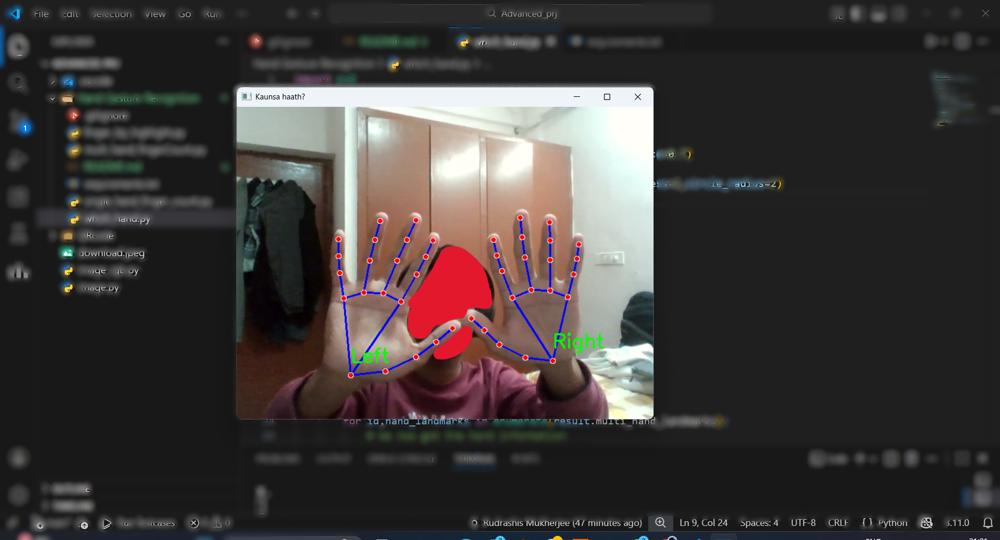
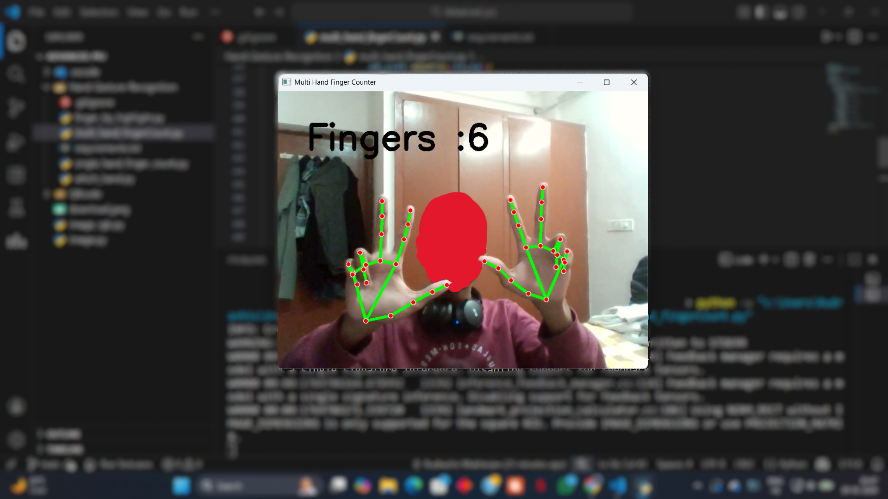

# 🖐️ Hand Gesture Recognition Suite


A real-time computer vision project that leverages **Google's MediaPipe** and **OpenCV** to perform precise hand tracking, landmark detection, and finger counting.

## 📸 Demo

| Hand Tracking | Finger Counting |
| :---: | :---: |
|  |  |
| *Real-time Hand detection* | *Accurate finger enumeration* |
## 📂 Included Modules

Here is a breakdown of the scripts included in this repository:

| File Name | Functionality |
| :--- | :--- |
| **`single_hand_finger_count.py`** | Basic implementation to detect and count fingers for a single hand. |
| **`multi_hand_fingerCount.py`** | Advanced logic to track multiple hands simultaneously and calculate the total finger count. |
| **`which_hand.py`** | Classification logic to distinguish between **Left** and **Right** hands. |
| **`finger_tip_highlight.py`** | Visual utility that specifically highlights the 5 key landmarks (fingertips) on the video feed. |

## 🛠️ Installation & Usage

1.  **Clone the repository**
    ```bash
    git clone https://github.com/mukherjeerudrashis-create/Hand-Gesture-Recognition-Suite.git
   
    ```

2.  **Install Dependencies**
    ```bash
    pip install -r requirements.txt
    ```

3.  **Run a Script**
    You can run any of the modules directly. For example:
    ```bash
    python multi_hand_fingerCount.py
    ```

## 🤝 Contributing
Feel free to fork this repository and submit pull requests.

---
*Created by [Rudrashis Mukherjee] - IIIT Naya Raipur*